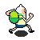
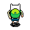
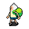

# :video_game: Game Coleta Feliz :video_game:

    
    
    

 
O game **Coleta Feliz** é um projeto simples desenvolvido em Java para aprovação do 3ª semestre do curso de Ciência da Computação.
 
## :trophy: Jogabilidade
 
O objetivo do jogo é coletar o máximo de itens recicláveis possíveis e depositar em suas respectivas lixeiras dentro do tempo limite. Cada reciclável depositado na lixeira correta você ganha 1 ponto, caso deposite na lixeira errada você perde 1 ponto.

     

## :space_invader: Niveis de dificuldade
- **Fácil** - Cronometro e recicláveis em velocidade razoável e lixeiras nas bordas da fase
- **Difícil** - Cronometro e recicláveis em velocidade moderada e lixeiras no meio da fase.

## :recycle: Recicláveis e Lixeiras
- Vidro  na lixeira verde 

- Papel  na lixeira azul 

- Metal  na lixeira amarela 

- Orgânico  na lixeira marrom 

- Não reciclável  na lixeira cinza 

## :tv: Redes Sociais
 Abaixo algumas das minhas redes sociais:
 
    
  
   
  
   

  
