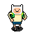
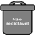

# Game Coleta Feliz
 
         
 
O game **Coleta Feliz** é um projeto simples desenvolvido em Java para aprovação do 3ª semestre do curso de Ciência da Computação.
 
## Jogabilidade
 
O objetivo do jogo é coletar o máximo de itens recicláveis possíveis e depositar em suas respectivas lixeiras dentro do tempo limite. Cada reciclável depositado na lixeira correta você ganha 1 ponto, caso deposite na lixeira errada você perde 1 ponto.

## Niveis de dificuldade
- Fácil - Cronometro e recicláveis em velocidade razoável e lixeiras nas bordas da fase
- Difícil - Cronometro e recicláveis em velocidade moderada e lixeiras no meio da fase.

## Recicláveis e Lixeiras
- Vidro  na lixeira 

- Papel  na lixeira 

- Metal  na lixeira 

- Orgânico  na lixeira 

- Não reciclável  na lixeira 

##
Para mais projetos acesse [meu Github](https://github.com/AbnerPS).
